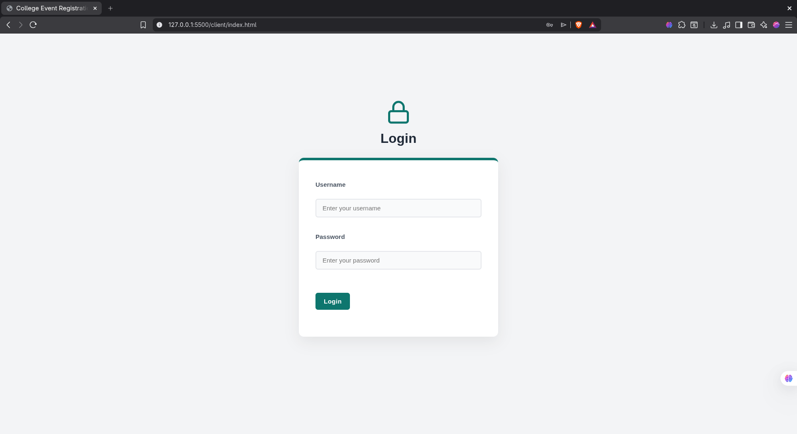
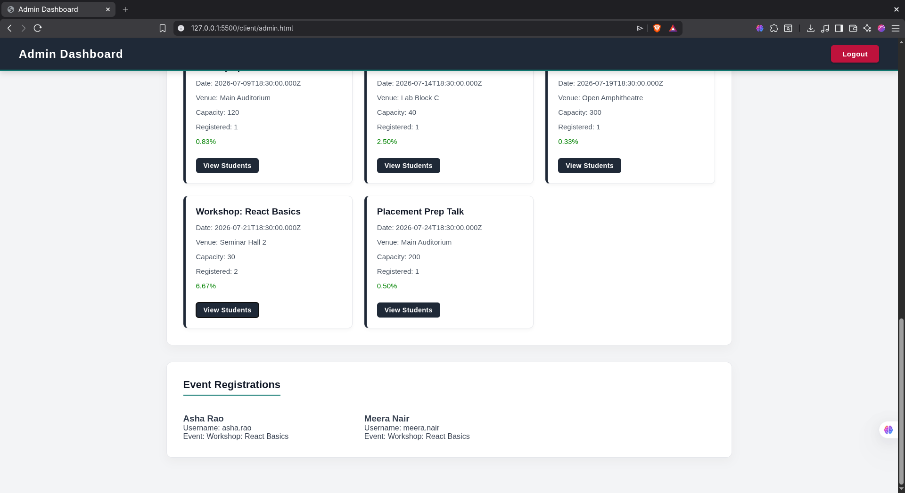
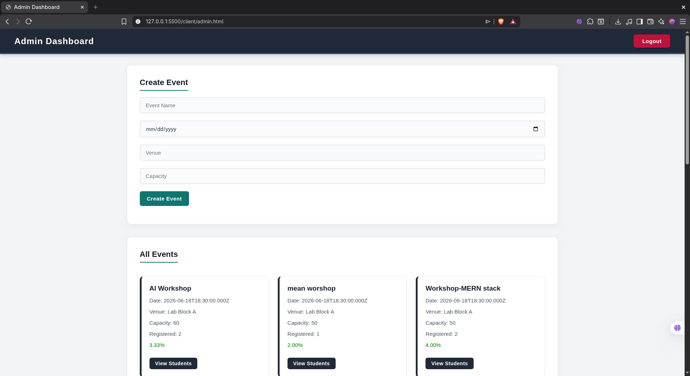
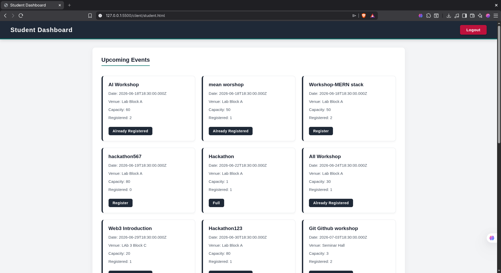
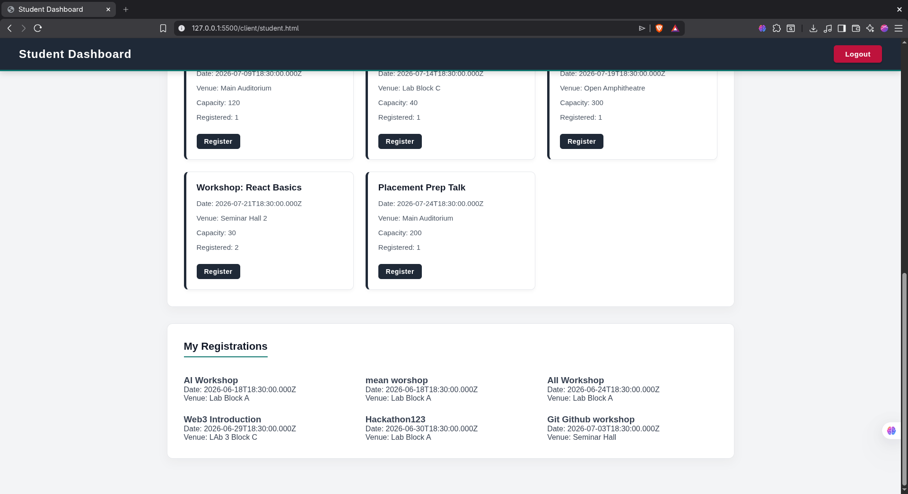

# College Event Registration Portal

**Submission Reference Code:** ISP-WEB-2631

A full-stack web application developed as part of the Inspirante Web Development Internship Take-Home Assignment.

The application allows administrators to create and manage college events while enabling students to browse and register for upcoming events.

# College Event Registration System

## Login Page



## Admin Dashboard




## Student Dashboard




---

# Features

## Admin

* Login using JWT authentication
* Create new events
* View all events
* View registration counts for each event
* View students registered for a specific event
* View event capacity fill percentage with color coding:

  * Green: Below 50%
  * Amber: 50%–79%
  * Red: 80% and above

## Student

* Login using JWT authentication
* Browse all upcoming events
* Register for available events
* Prevent duplicate registrations
* View personal registrations
* Automatically display events as **Full** when capacity is reached

---

# Tech Stack

## Frontend

* HTML
* CSS
* Vanilla JavaScript

## Backend

* Node.js
* Express.js

## Database

* MySQL / MariaDB

## Authentication

* JSON Web Tokens (JWT)

---

# Project Structure

```text
inspirante-atmika
│
├── client
│   ├── css
│   │   └── style.css
│   │
│   ├── js
│   │   ├── login.js
│   │   ├── student.js
│   │   └── admin.js
│   │
│   ├── index.html
│   ├── student.html
│   └── admin.html
│
├── server
│   ├── config
│   ├── controllers
│   ├── middleware
│   ├── migrations
│   │   ├── schema.sql
│   │   └── seed.sql
│   ├── routes
│   ├── package.json
│   ├── server.js
│   └── .env.example
│
├── README.md
└── DECISIONS.md
```

---

# Prerequisites

Before running the project, install:

* Node.js (v18+ recommended)
* npm
* MySQL or MariaDB

Verify installation:

```bash
node -v
npm -v
mysql --version
```

---

# Local Setup

## 1. Clone the Repository

```bash
git clone <repository-url>
cd inspirante-atmika
```

---

## 2. Create Database

Login to MySQL:

```bash
mysql -u root -p
```

Create the database:

```sql
CREATE DATABASE college_events;
```

Exit MySQL:

```sql
EXIT;
```

---

## 3. Import Schema

From the project root:

```bash
mysql -u <your_mysql_username> -p college_events < server/migrations/schema.sql
```

---

## 4. Seed Sample Data

```bash
mysql -u <your_mysql_username> -p college_events < server/migrations/seed.sql
```

This will populate:

* Admin account
* Student accounts
* Sample events

required for testing.

---

## 5. Configure Environment Variables

Inside the `server` directory:

```bash
cp .env.example .env
```

Update the values according to your local MySQL setup.

Example:

```env
PORT=3000

DB_HOST=localhost
DB_USER=college_user
DB_PASSWORD=college_password
DB_NAME=college_events

JWT_SECRET=your_jwt_secret
```

---

## 6. Install Dependencies

Navigate to the server folder:

```bash
cd server
npm install
```

---

## 7. Start the Backend

```bash
npm start
```

Expected output:

```text
Database connected successfully
Server is running on port 3000
```

---

## Development Mode

To run with automatic restarts:

```bash
npm run dev
```

---

## 8. Run the Frontend

Open the client folder using:

* VS Code Live Server (recommended)

or

* Any static file server

Open:

```text
client/index.html
```

in your browser.

---

# Sample Credentials

## Admin

```text
Username: admin
Password: inspirante2026
```

## Student

```text
Username: asha.rao
Password: student123
```

Additional student accounts are available through the seed data.

---

# API Endpoints

## Authentication

```http
POST /api/login
GET  /api/profile
```

## Events

```http
GET  /api/events
GET  /api/events/:id
POST /api/events
GET  /api/events/:id/registrations
```

## Registrations

```http
POST /api/register
GET  /api/register/mine
```

---

# Environment Variables

The application requires:

| Variable    | Description         |
| ----------- | ------------------- |
| PORT        | Backend server port |
| DB_HOST     | Database host       |
| DB_USER     | MySQL username      |
| DB_PASSWORD | MySQL password      |
| DB_NAME     | Database name       |
| JWT_SECRET  | JWT signing secret  |

---

# .env.example

```env
PORT=3000

DB_HOST=localhost
DB_USER=your_mysql_username
DB_PASSWORD=your_mysql_password
DB_NAME=college_events

JWT_SECRET=your_jwt_secret
```

---

# Known Limitations

1. Passwords are stored in plain text because the assignment explicitly allowed hardcoded credentials and did not require a registration system.

2. API URLs are currently configured for localhost development.

3. Event editing and deletion are not implemented because they were not part of the assignment requirements.

4. JWT tokens are stored in localStorage for simplicity in this take-home project.

---

# Future Improvements

With additional development time, the following improvements would be implemented:

* Password hashing using bcrypt
* Refresh token authentication
* Event editing and deletion
* Automated testing using Jest and Supertest
* Improved responsive design
* Docker-based deployment setup

---

# Author

Atmika Nayak

Developed for the Inspirante Web Development Internship Assignment.
